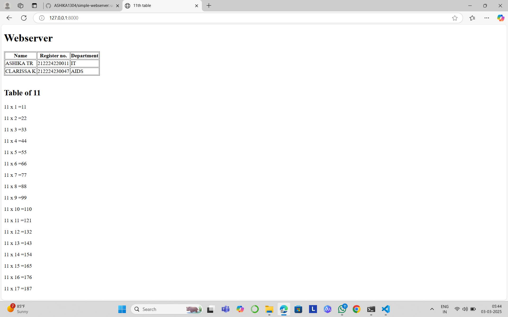

 
# EX01 Developing a Simple Webserver
## Date:

## AIM:
To develop a simple webserver to serve html pages and display the configuration details of laptop.

## DESIGN STEPS:
### Step 1: 
HTML content creation.

### Step 2:
Design of webserver workflow.

### Step 3:
Implementation using Python code.

### Step 4:
Serving the HTML pages.

### Step 5:
Testing the webserver.

## PROGRAM:
```html
<!DOCTYPE html>
<html lang="en">
<head>
    <meta charset="UTF-8">
    <meta name="viewport" content="width=device-width, initial-scale=1.0">
    <title>11th table</title>
</head>
<body>
    <h1>Webserver</h1>
    <table border="1">
        <tr>
            <th>Name</th>
            <th>Register no.</th>
            <th>Department</th>
        </tr>
        <tr>
            <td>ASHIKA TR</td>
            <td>212224220011</td>
            <td>IT</td>
        </tr>
        <tr>
            <td>CLARISSA K</td>
            <td>212224230047</td>
            <td>AIDS</td>
        </tr>
    </table>
    <br>
    <h2>Table of 11</h2>
    
    <p>11 x 1 =11</p>
    <p>11 x 2 =22</p>
    <p>11 x 3 =33</p>
    <p>11 x 4 =44</p>
    <p>11 x 5 =55</p>
    <p>11 x 6 =66</p>
    <p>11 x 7 =77</p>
    <p>11 x 8 =88</p>
    <p>11 x 9 =99</p>
    <p>11 x 10 =110</p>
    <p>11 x 11 =121</p>
    <p>11 x 12 =132</p>
    <p>11 x 13 =143</p>
    <p>11 x 14 =154</p>
    <p>11 x 15 =165</p>
    <p>11 x 16 =176</p>
    <p>11 x 17 =187</p>
</body>
</html>
```

## OUTPUT:




## RESULT:
The program for implementing simple webserver is executed successfully.
